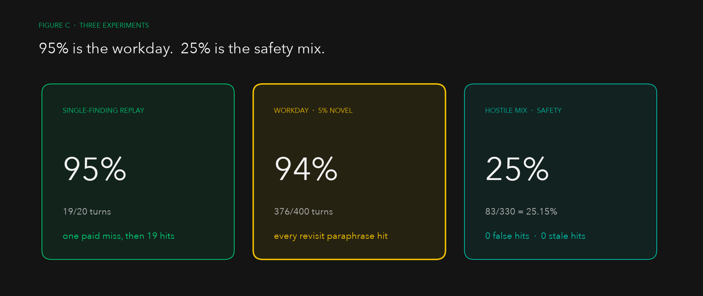
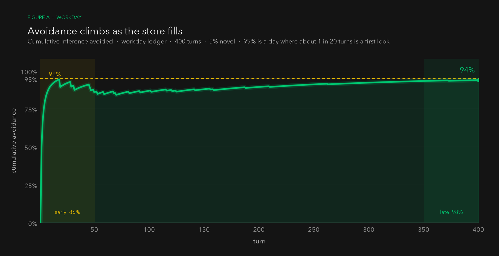
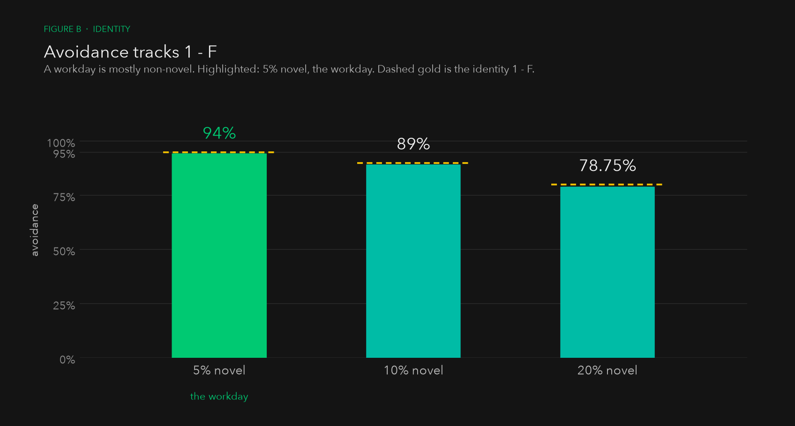
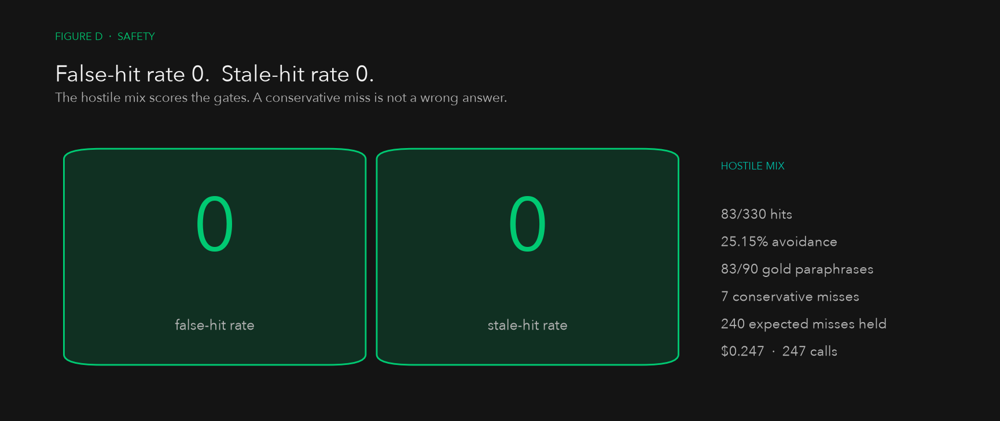

# Durable state makes a workday cheap

Most turns are not a first look. Query completed work before inference, and
a day where about 1 in 20 turns is novel costs 5% of the model calls.

**95% is the workday.** One paid miss, then 19 zero-call recalls of a stored
finding. **25% is the safety mix:** 330 hostile turns, 0 false hits, 0 stale
hits.



A first look at a repo or bug still costs a full model call. Later turns on
the same finding do not. Completed work lives in a local SQLite store
(claims, artifacts, receipts). Every turn queries that store first. A hit
returns the stored result with no model call. A miss builds a small bounded
context, infers once, then persists.

> Treat context as a cache, not as its database.

The expensive design is a permanent head seat that carries permanent role
runtimes, internal transcripts, and self-correction history. Each new turn
replays more context, and the system pays again for work that another worker
already completed.

Move memory and completed work out of the model context and into durable
state. The store fills. The rest of the day is cheap.



Avoidance tracks 1 − F. At 5% novel, that is 95%. At 10%, 90%. At 20%, 80%.
Highlighted: the workday.



The hostile mix scores the gates — paraphrases of a stored finding,
follow-ups, slightly changed requirements, evolving repositories, stale
findings, conflicting claims, unrelated questions. 83 of 90 gold paraphrases
hit. Seven conservative misses. 240 expected misses held. False-hit rate 0.
Stale-hit rate 0. $0.247. 247 inference calls.



## The request path

The request path is deliberately ordered:

```text
user turn
    |
    v
owner-scoped claim lookup
    |                         \
    | hit                      \ miss
    v                           v
return stored result       build bounded working set
write zero-call receipt    call the mouth once
                                |
                                v
                         persist result and receipt
```

On a relevant claim hit, the system returns the stored result without making
an OpenRouter request. The receipt records `outcome=hit` and
`inferenceAvoided=true`. This is a real zero-call cache hit, not a prompt that
asks a model to remember something.

Only a miss reaches inference. The miss prompt contains:

- the system instruction
- relevant claims retrieved from durable state
- the selected story, when the compaction layer has one
- a small recent-message tail

It does not carry the entire historical transcript. The shipped Automaton
mouth used a recent tail of eight messages.

## The architecture

### 1. Roles are ephemeral; records are durable

Do not keep every agent alive as a transcript-carrying participant. A mouth
handles a turn, then the runtime can disappear. The durable backend keeps the
things that have future value:

- session snapshots and thread state
- claims: verified spoken lines and findings
- task results and artifact references
- agent ownership and job provenance
- per-turn usage receipts

In Automaton, this is a local SQLite store. A completed job becomes a
job-sourced claim instead of remaining only inside a worker transcript.
Inserting the same claim again is idempotent.

### 2. Query durable state before invoking a model

That is the path above. `queryFirst` is the gate. Hits skip the mouth.
Misses pay once, then persist.

### 3. Reuse work by identity, not by hope

The same rule applies to jobs. A previous artifact is reusable only when its
identity and freshness match the new request:

- repository and profile
- owning agent
- normalized task
- relevant inputs
- successful, live terminal status
- substantive artifact or finding

Automaton's current analyze-reuse gate enforces the owning agent, normalized
goal, live successful status, and substantive-artifact checks. Extending the
identity with repository, profile, input, and freshness fingerprints is the
next hardening step.

Puppetmaster remains the job runtime, not the ordinary-chat runtime. Job
handles are persisted so a relaunch attaches to an existing job instead of
spawning a duplicate. Analyze launches carry a local launch key for
idempotent recovery. Implement jobs always get fresh sandboxes and are never
reused as prior implementation work.

An attached job with an unavailable status is bounded and fails closed. It is
not watched forever and it is not reported as successful merely because the
worker disappeared.

### 4. Compact old conversation into a retrieval layer

Older conversation should not remain an ever-growing prompt source. The
retention layer uses the catalog-residual shape:

- extractive handles for older material
- a bounded, last-wins selected story
- a session-scoped SQLite FTS vault for lexical retrieval

This layer is derived context. It is not the authority. Claims and verified
job artifacts remain authoritative. FTS hits can help retrieve context but
cannot answer a query directly, and the full vault is never injected into
every prompt.

In the current Automaton checkpoint, the durable claims, bounded working set,
and reuse ledger are shipped; catalog-residual compaction is the next
retention boundary. The separation is intentional: compaction can change
prompt context without changing the truth of a completed job.

### 5. Measure the cache instead of assuming it works

Every turn writes a receipt with:

- hit or miss outcome
- model and terminal status
- nullable prompt tokens, completion tokens, and cost
- whether inference was avoided
- whether inference was attempted

The ledger counts avoided calls and attempted calls separately. Provider usage
that is missing remains unknown; it is not converted into fake zero cost.
This makes the claimed reduction testable:

```text
avoided calls / total turns
known token totals
known provider cost
unknown usage that still needs attribution
```

A missing API key is not an inference attempt. A failed provider call is an
attempt. Those cases must not be collapsed into one misleading number.

## The concrete implementation shape

The important boundaries in Automaton are:

- `StaffStore`: durable sessions, claims, receipts, and aggregate metrics
- `queryFirst`: authoritative claim lookup before inference
- `buildWorkingSet`: system prompt plus recalled claims plus bounded tail
- `ensureMouth`: hit handling, one bounded inference path, and receipts
- `ensureDispatched`: persisted attachment and safe analyze reuse
- `Puppetmaster` adapters: sandbox jobs, artifact references, and status

The product UI is not the cache. The chat transcript is not the artifact
store. Puppetmaster is not the mouth. Each layer has one job.

## Why this produces the reduction

The high-cost system pays for coordination every time:

```text
question -> permanent roles -> growing transcripts -> repeated inference
```

The durable system pays for novel work once:

```text
question -> durable lookup -> hit -> answer
                         \
                          miss -> small prompt -> work -> durable result
```

After one worker has completed a reusable result, the next matching request
is a query. It does not need another head-agent debate, another permanent role
runtime, or another full transcript.

A workday is mostly those later turns. That mix is why 19 of 20 turns avoided
inference, and why 5% novel is 95%.

## What we measured

### Single-finding replay — 19/20 = 95%

Turn 1 is a novel question. `queryFirst` misses and one mocked mouth call is
the paid inference. Chat misses do not `remember()` themselves. After that
miss the replay seeds one job-sourced Kernel claim (`The ledger replay is
deterministic.`) as if a worker had finished. Turns 2–20 ask `what did Kernel
find about ledger replay` and hit with `inferenceAvoided=true` and no further
ChatFn calls.

That is a 5% novel day: one first look in twenty turns.

Ledger: [`repeated-work-ledger.json`](./repeated-work-ledger.json).

### Workday — 5% novel = 376/400 = 94%

400 turns against Automaton's real `ensureMouth` + `StaffStore` +
`queryFirst` (mocked ChatFn, temp sqlite, never `~/.automaton/staff.sqlite`).
Empty store. 20 morning-weighted first looks; after each miss the replay
persists a job-sourced Kernel claim the way a finished worker would. 376
recall-shaped paraphrases of those findings: 376 hits. Two follow-ups and
two unrelated turns miss, as labeled. False-hit rate 0. Stale-hit rate 0.
$0.024. 24 inference calls.

Early window (turns 1–50): 86%. Late window (turns 351–400): 98%. The store
fills. The rest of the day is cheap.

| novel | avoidance | 1 − F | first looks | hits |
| --- | --- | --- | --- | --- |
| 5% (the workday) | 376/400 = 94% | 95% | 20 | 376 |
| 10% | 356/400 = 89% | 90% | 40 | 356 |
| 20% | 315/400 = 78.75% | 80% | 80 | 315 |

Avoidance tracks 1 − F. 95% is a day where about 1 in 20 turns is a first
look. The 19/20 replay is the single-finding limit of that day.

- [`workday-eval-ledger.json`](./workday-eval-ledger.json) — 5% series, windows, and 5/10/20% overalls
- [`workday-eval-spec.json`](./workday-eval-spec.json) — seed, mix, and gold labels

### Hostile mix — 330 turns = 25.15%, 0 false hits

330 seeded turns against Automaton's real `ensureMouth` + `StaffStore` +
`queryFirst` (mocked ChatFn, temp sqlite, never `~/.automaton/staff.sqlite`).

| metric | value |
| --- | --- |
| turns | 330 |
| avoidance (`inferenceAvoided / turns`) | 83/330 = 25.15% |
| false-hit rate | 0 |
| stale-hit rate | 0 |
| `inferenceCalls` | 247 |
| `costUsd` (mocked $0.001 on a miss, $0 on a hit) | 0.247 |

83 of 90 gold paraphrases hit. The other 7 were conservative misses. Every
follow-up, changed-requirement, evolved-revision, stale, conflict, and
unrelated turn missed. UniqueSpeakable did not pick a side on two speakable
claims. An old revision did not serve when a newer revision of the same task
was also stored.

95% is the workday. 25% is the safety mix.

- [`tough-eval-ledger.json`](./tough-eval-ledger.json) — per-turn rows and summary
- [`tough-eval-spec.json`](./tough-eval-spec.json) — seed, claims, and gold labels
- [`replay-tough-eval.ts`](./replay-tough-eval.ts) — generator (run from Automaton)

The live `~/.automaton/staff.sqlite` mix is 1 hit / 51 turns. That is an
early mixed desk filling the store, not the workday.

## How to run

This repo is the architecture note plus captured receipt ledgers. The runners
live in the Automaton tree and use a temp sqlite path. They do not read
`~/.automaton/staff.sqlite`.

```sh
bun scripts/replay-repeated-work.ts
bun scripts/replay-tough-eval.ts
bun scripts/replay-workday-eval.ts
```

Regenerate the figures:

```sh
python3 -m venv .venv
.venv/bin/pip install matplotlib
.venv/bin/python charts/render.py
```

## Prescription

> Treat context as a cache, not as the database. Make agent roles ephemeral.
> Persist sessions, claims, task results, artifacts, provenance, and usage
> receipts. Query verified durable state before inference. On a miss, provide
> only relevant claims, the selected story, and a recent tail. Reuse work only
> when repository, profile, task, inputs, and freshness match. Compact old
> history into extractive handles, a last-wins story, and a bounded searchable
> vault. Pay once for work, query it next time, and measure avoided calls,
> tokens, and dollars honestly.

This is a backend and ownership change, not a summarization feature.
